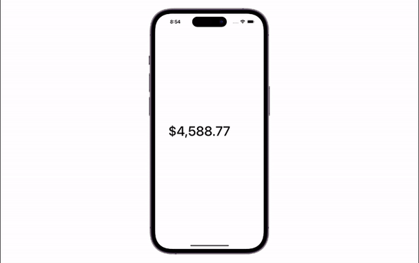

# RollingNumbers

[](https://cocoapods.org/pods/RollingNumbers)
[](https://cocoapods.org/pods/RollingNumbers)
[](https://cocoapods.org/pods/RollingNumbers)

RollingNumbers is a lightweight UIView for getting smooth rolling animation between numbers implemented using only CALayer. 



In [Triumph Arcade](https://github.com/triumpharcade) building [Triumph SDK](https://github.com/triumpharcade/triumph-sdk-ios) for game developers. I had a task to create Rolling Numbers animation for a balance component. Sometimes we cannot afford to use third-party libraries, so I decided to make my own solution using only `CALayers` in purpose to avoid performance issues.

## Requirements

- iOS 11.0+
- Swift 5.0+

## Instalation

### Cocoapod

RollingNumbers is available through [CocoaPods](https://cocoapods.org/):

```ruby
pod 'RollingNumbers'
```

### Swift Package Manager

```
https://github.com/maxkalik/RollingNumbers.git
```

## Usage

Initialize a RollingNumbersView.

```swift
let view = RollingNumbersView()
```

Set number with animation

```swift
rollingNumbersView.setNumberWithAnimation(1234.56)
```

Set number without animation

```swift
rollingNumbersView.setNumber(1234.56)
```

## Configuration

```swift

var rollingNumbersView = {
    // Initialize Rolling Numbers view with initial number value
    let view = RollingNumbersView(number: 1234.56)
    
    // Configure animation type
    view.animationType = .onlyChangedDigits
    
    // Rolling direction will scroll only up
    view.rollingDirection = .up
    
    // Spacing between numbers
    view.characterSpacing = 1
    
    // Text color
    view.textColor = .black
    
    // Alignment within UIView
    view.alignment = .left
    
    // UIFont
    view.font = .systemFont(ofSize: 48, weight: .medium)
    
    let formatter = NumberFormatter()
    formatter.numberStyle = .currency
    view.formatter = formatter
    
    return view
}()

```

### Animation Type

| Type                         | Description                                     |
| ---------------------------- | ----------------------------------------------- |
| `allNumbers`                 | All numbers roll if even only one number change |
| `onlyChangedNumbers`         | Only changed numbers roll                       |
| `allAfterFirstChangedNumber` | All numbers roll after first changed number     |
| `noAnimation`                | Numbers change without animation                |


### Animation Direction

| Type   | Description                                 |
| ----   | ------------------------------------------- |
| `up`   | Rolling animation direction from up to down |
| `down` | Rolling animation direction from down to up |

### Specific Configureation

Set text color with animation with optional transition duration between existing color and the next one.

```swift
rollingNumbersView.setTextColor(.blue, withAnimationDuration: 3)
```

### Animation Configuration

```swift
rollingNumbersView.animationConfiguration = RollingNumbersView.AnimationConfiguration(
    duration: 3,
    speed: 0.3,
    damping: 17,
    initialVelocity: 1
)
```

### Completion

Use completion for each numbers animation

```swift
rollingNumbersView.setNumberWithAnimation(245699) {
    // completion
}
```

## Contributing

Be welcome to contribute to this project!

## License

This project was released under the [MIT](https://github.com/maxkalik/RollingNumbers/blob/master/LICENSE) license.

## Author

Max Kalik, maxkalik@gmail.com
